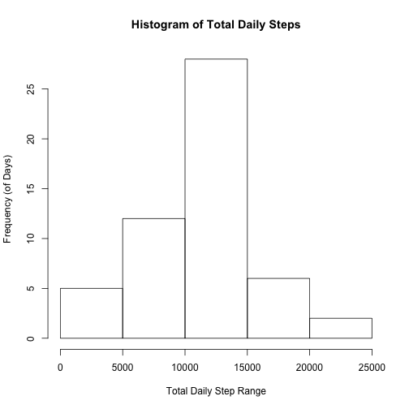
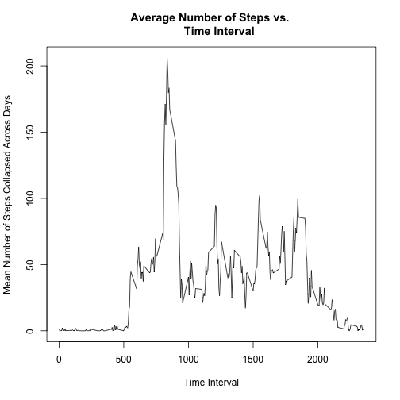
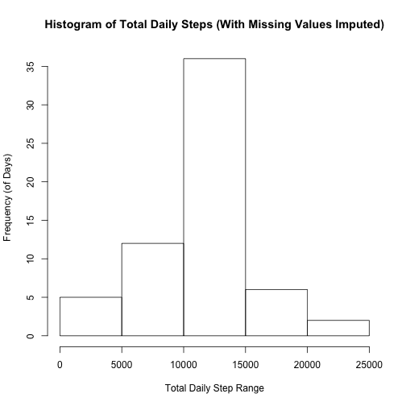
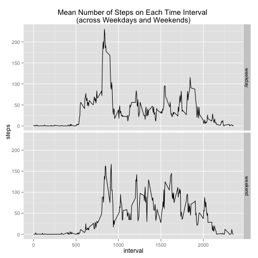

<br>

## Loading and preprocessing the data
Below is the code for reading in the data. Date is converted from a factor into Date format (for later use of the weekdays function). Also, there is no need to convert the integer class "interval" into a time format, as the same pattern of data will result with having the intervals indicated by integer labels. Additionally, the dplyr and ggplot2 libraries are loaded, for use of their functions later.

```r
library(dplyr)
library(ggplot2)
activityData <- read.csv("activity.csv")
activityData <- mutate(activityData, date = as.Date(date))
```
<br>

## What is the mean number of steps taken per day?
To make a histogram of the total number of steps taken per day, I first group the data by date. After the result is passed to "summarise," the resulting dataframe has, for each date, the total number number of daily steps taken.

```r
daily <- group_by(activityData, date) %>% summarise(dailysteps = sum(steps))
```
<br>

From the data with total steps for each day, a histogram for frequency (of days) on various ranges of total steps. The default setting gives a break at every 5000 steps. Thus the step-ranges for which the day-frequencies are given are 0-5000, 5001-10,000, etc.

```r
hist(daily$dailysteps, main = "Histogram of Total Daily Steps", xlab = "Total Daily Step Range", 
    ylab = "Frequency (of Days)")
```

 
<br>

Below the mean of total daily steps is computed (with NA values removed).

```r
mean(daily$dailysteps, na.rm = TRUE)
```

```
## [1] 10766.19
```
<br>

Below, the median (with NA values removed) of the total daily steps is computed.

```r
median(daily$dailysteps, na.rm = TRUE)
```

```
## [1] 10765
```
<br>

## What is the average daily activity pattern?
To get the average number of steps taken on each time interval (collapsed across days), first I group the data by time interval, and then get the mean of the number of steps taken on each time interval, computed under the variable timeSteps in the summarise function:

```r
time.grouped <- group_by(activityData, interval) %>% summarise(timeSteps = mean(steps, na.rm = TRUE))
```
<br>

This allows a plot of mean number of steps on each time interval to be produced as follows:

```r
plot(time.grouped$interval, time.grouped$timeSteps, type = "l", main = "Average Number of Steps vs. 
     Time Interval", xlab = "Time Interval", ylab = "Mean Number of Steps Collapsed Across Days")
```

 
<br>

The interval with the maximum average number of steps across all days can be obtained as follows:

```r
filter(time.grouped, timeSteps == max(timeSteps, na.rm = TRUE))$interval 
```

```
## [1] 835
```
<br>

## Imputing missing values
To get a sense of how impactful missing steps data is, below is a count of the number of NAs in the orignal dataset.

```r
sum(is.na(activityData$steps))
```

```
## [1] 2304
```
<br>

To impute all the NAs in the data, my strategy will be to replace them with the mean (across all days) of the number of steps taken on the time interval for which the NA occurs. The first step below is to make a function which gives this mean for any interval.

```r
meanStepsForInterval <- function(int) {
    fdata <- filter(activityData, interval == int);
    mean(fdata$steps, na.rm = TRUE)
}
```
<br>

Then, my strategy is to split the data into f.NAdata and f.NumberData. The first consists of only the data that has NA values for steps. The latter consists of only the data that has number values for steps. Then I sapply the meanStepsForInterval function to replace the steps values in f.NAdata (all NAs) with the imputed values, as computed by that function. Then I recombine the f.NAdata with the f.NumberData, to make activityDataImputed, which amounts to the original dataset with NA values filled-in by imputed values.

```r
f.NAdata <- filter(activityData, is.na(steps))
f.NumberData <- filter(activityData, !is.na(steps))
f.NAdata$steps <- sapply(f.NAdata$interval, meanStepsForInterval)
activityDataImputed <- rbind(f.NAdata, f.NumberData) %>% arrange(date, interval)
```
<br>

Now to get the data on the total number of daily steps for the NA-filled-in (imputed data), I use group_by and summarise as before:

```r
dailyImputed <- group_by(activityDataImputed, date) %>% summarise(dailysteps = sum(steps))
```
<br>

Now for the NA-filled dataset, the mean and median for the total number of daily steps are computed as follows: 

```r
mean(dailyImputed$dailysteps)
```

```
## [1] 10766.19
```

```r
median(dailyImputed$dailysteps)
```

```
## [1] 10766.19
```
Suprisingly, there is no difference between the mean for the total number of steps when imputing (by the above method) NA values versus omitting them. Imputing by the above method also makes the median exactly the same as the mean. Overall, the effect of imputing is minimal, not shifting the mean at all and shifting the median by a little over one step.
<br>

The histogram for the total number of daily steps (with missing values imputed) is as follows:

```r
hist(dailyImputed$dailysteps, main = "Histogram of Total Daily Steps (With Missing Values Imputed)", 
    xlab = "Total Daily Step Range", ylab = "Frequency (of Days)")
```

 
<br>

## Are there differences in activity patterns between weekdays and weekends?
To get the mean number of steps on each time interval, separated out for weekdays to weekend, the first step is to get the day of the week for each day. This is done below in the "day" factor. The next step is to collapse the levels of the day factor from the seven days of the week, to just labelling whether the day is a weekday or weekend. This is done below after the first step.

```r
activityDataImputed <- mutate(activityDataImputed, day = weekdays(date) %>% factor)
levels(activityDataImputed$day) <- list(weekday = c("Monday", "Tuesday", "Wednesday", "Thursday", "Friday"), 
                                        weekend = c("Saturday", "Sunday"))
```
<br>

Next, the data is grouped by interval and day, and then with "summarise"" the mean number of steps (across the time interval, separately for "weekday" and "weekend") is taken.

```r
intervalSteps <- group_by(activityDataImputed, interval, day) %>% summarise(steps = mean(steps))
```
<br>

Finally, the data for the mean number of steps across each time interval, for each level of "day" (weekday and weekend) is plotted.

```r
ggplot(data = intervalSteps, aes(interval, steps)) +
    geom_line() +
    facet_grid(day ~ .) +
    ggtitle("Mean Number of Steps on Each Time Interval \n(across Weekdays and Weekends)")
```

 
